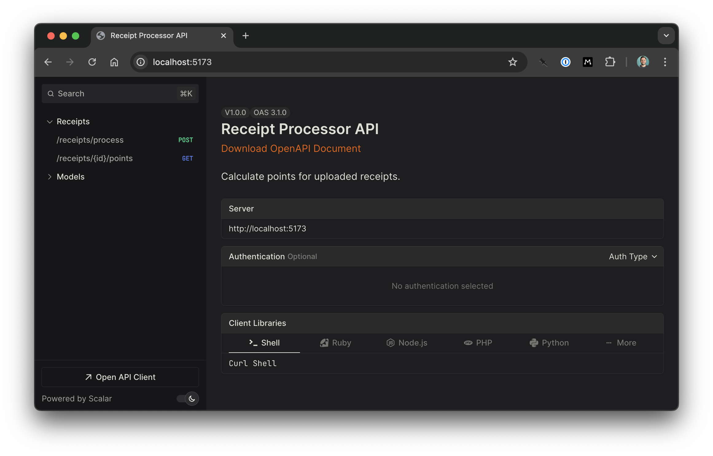

# Receipt Processor

An HTTP REST API that calculates points for an uploaded receipt.



## Running Locally with Docker

If you only want to see the application running, you can run it with Docker.

```sh
docker compose up
```

Then navigate to http://localhost:3000 in your browser.

## Running Locally with Node

If you're doing development on this project, you'll have the best experience
running it locally with Node.

You'll need Node.js v22 installed on your computer. If you don't have it,
I recommend using the [proto](https://moonrepo.dev/proto) tool. Once you
install it, you can run `proto install` at the root of this project to
install the correct version of Node.

To start the server, run:

```sh
npm install
npm start
```

Then click the link in the terminal output.
